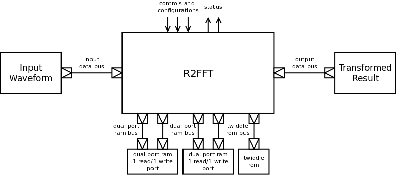
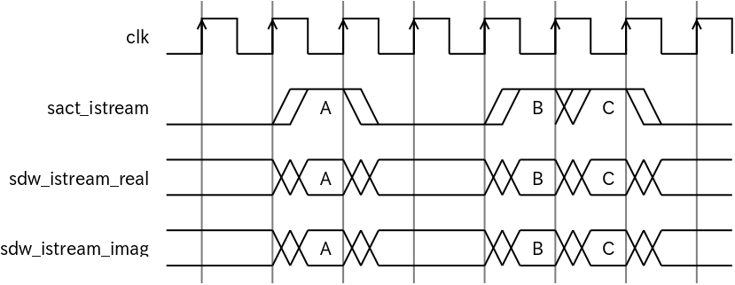
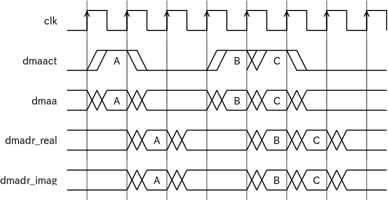
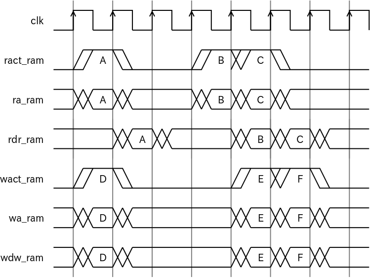
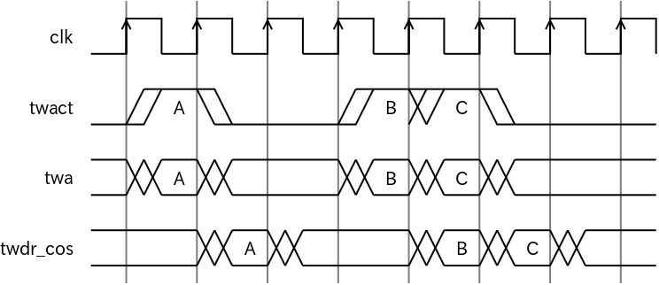
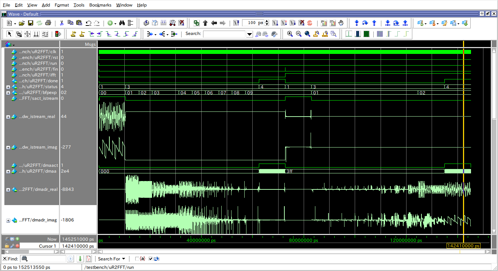

# R2FFT

## Introduction

R2FFT is a fully synthesizable verilog module for doing the FFT on an FPGA or ASIC.

## Key features

* Configurable 2^n transform length.
* Configurable data width.
* Support block floating point scaling.
* Small footprint implementation of single raidx-2 algorithm.
* FFT_LENGTH/2 \* log2(FFT_LENGTH) clock latency. 
* Forward and inverse FFT.
* Fully synthesizable, easy implementation to a FPGA or ASIC.

## Parameters
|name        |description            |
|:-----------|:----------------------|
|FFT_LENGTH  |FFT transform length, 2^n  |
|FFT_DW      |FFT operand data bit width |
|FFT_N       |log2(FFT_LENGTH)       |
|PL_DEPTH    |pipline depth (0 - 3)  |

## I/O
|name             |direction   |bit width       |description        |
|:----------------|:-----------|:---------------|:------------------|
|clk              |in          |1               |clock singal.       |
|rst              |in          |1               |active high synchronous reset signal. |
|autorun          |in          |1               |FFT is run automatically if input buffer has filled.|
|run              |in          |1               |trigger to start FFT processing.|
|fin              |in          |1               |trigger to finish output and start next FFT frame.|
|ifft             |in          |1               |inverse FFT if asserted.      |
|done             |out         |1               |assert by the R2FFT when there is valid data to output.|
|status           |out         |3               |status of the R2FFT. 0:IDLE/1:INPUT_STREAM/2:FULL_BUFFER/3:RUN_FFT/4:DONE|
|bfpexp           |out         |8               |exponent part of FFT results by block floating point scaling. signed number. output = dmadr * 2^bfpexp. |
|sact_istream     |in          |1               |input data bus active. |
|sdw_istream_real |in          |FFT_DW          |input data of real part. signed number.|
|sdw_istream_imag |in          |FFT_DW          |input data of imaginary part. signed number.|
|dmaact           |in          |1               |dma bus active.     |
|dmaa             |in          |FFT_N           |dma bus address.    |
|dmadr_real       |out         |FFT_DW          |dma read data. output of real part. signed number.|
|dmadr_imag       |out         |FFT_DW          |dma read data. output of imaginary part. signed number.|
|twact            |out         |1               |twiddle rom bus active. |
|twa              |out         |FFT_N-2         |twiddle rom address. |
|twdr_cos         |in          |FFT_DW          |twiddle rom read data. return (1<<(FFT_DW-1)) \* cos(2\*PI\*twa/FFT_LENGTH), unsinged number.|
|ract_ram0        |out         |1               |dual port ram0 read bus active. |
|ra_ram0          |out         |FFT_N-1         |dual port ram0 read address. |
|rdr_ram0         |in          |FFT_DW*2        |dual port ram0 read data. |
|wact_ram0        |out         |1               |dual port ram0 write bus active. |
|wa_ram0          |out         |FFT_N-1         |dual port ram0 write address. |
|wdw_ram0         |out         |FFT_DW*2        |dual port ram0 write data. |
|ract_ram1        |out         |1               |dual port ram1 read bus active. |
|ra_ram1          |out         |FFT_N-1         |dual port ram1 read address. |
|rdr_ram1         |in          |FFT_DW*2        |dual port ram1 read data. |
|wact_ram1        |out         |1               |dual port ram1 write bus active. |
|wa_ram1          |out         |FFT_N-1         |dual port ram1 write bus address. |
|wdw_ram1         |out         |FFT_DW*2        |dual port ram1 write data. |

## Block Diagram

### input data bus

### output data bus

### dual port ram bus

### twiddle rom bus

## Implementation Example

* 16-bit 1024 point FFT with 2 dual port ram and 1 twiddle rom.

>Family : Cyclone IV E  
Device : EP4CE22F17C6  
Timing Models : Final  
Total logic elements : 1,455 / 22,320 ( 7 % )  
    Total combinational functions : 1,297 / 22,320 ( 6 % )  
    Dedicated logic registers : 594 / 22,320 ( 3 % )  
Total registers : 594  
Total pins : 51 / 154 ( 33 % )  
Total virtual pins : 0  
Total memory bits : 36,918 / 608,256 ( 6 % )  
Embedded Multiplier 9-bit elements : 6 / 132 ( 5 % )  

* Slow 1200mV 85C Model Fmax Summary

| Fmax       | Restricted Fmax | Clock Name | Note |  
|:-----------|:----------------|:-----------|:-----|
| 110.05 MHz | 110.05 MHz      | clk        |      |  

## Testbench

* example of FFT and IFFT

